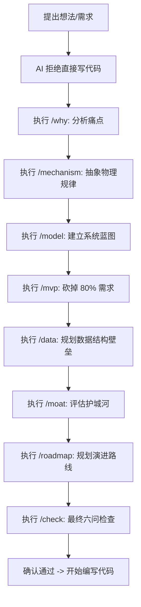

# Product Architecture Skill (产品架构技能) - 跨平台集成指南

本文件夹提供了将**产品架构技能（Product Architecture Skill）**集成到任何主流 AI 编程助手（IDE/平台）中的方案。

## 目录结构
* `.cursorrules` (项目根目录) - Cursor 规则文件，自动加载。
* `.windsurfrules` (项目根目录) - Windsurf 规则文件，自动加载。
* [README.md](file:///home/dev/learniny-system/docs/ai-skills/product-architecture/README.md) - 本指南文件。
* [templates/](file:///home/dev/learniny-system/docs/ai-skills/product-architecture/templates/) - 各层级分析的标准 Markdown 填充模板。

---

## 🛠 常见 IDE 与平台配置指南

### 1. Cursor
* **如何使用**：项目根目录下的 `.cursorrules` 已经自动生效。
* **效果**：Cursor 在该项目下启动时，会自动将此规则加入 System Prompt，强制其遵循 WHY → WHAT → HOW，并且在输入 `/why` 等指令时触发对应的步骤。

### 2. Windsurf
* **如何使用**：项目根目录下的 `.windsurfrules` 已经自动生效。
* **效果**：Windsurf 里的 AI 助手（Membrain）会自动读取并严格执行该产品规划流程。

### 3. VS Code + Roo Cline (Cline) / Cline 衍生插件
* **如何使用**：
  1. 打开 Roo Cline 插件设置。
  2. 找到 `Custom System Prompt` / `Instructions` 输入框。
  3. 将项目根目录下 `.cursorrules` 的内容复制粘贴进去。

### 4. VS Code + GitHub Copilot (Copilot Instructions)
* **如何使用**：
  * 在项目根目录下，新建或编辑 `.github/copilot-instructions.md`。
  * 将 `.cursorrules` 中的内容复制并粘贴进去。Copilot Chat 会在回答时自动加载此上下文。

### 5. Claude Desktop (官方桌面版客户端)
* **如何使用**：
  * 编辑 Claude Desktop 的配置文件 `claude_desktop_config.json`（Windows 路径为 `%APPDATA%\Claude\claude_desktop_config.json`，Mac 路径为 `~/Library/Application Support/Claude/claude_desktop_config.json`）。
  * 可以在 `systemPrompt` 或配置中加入对应的指令，或者使用 MPC 工具直接读取 `.cursorrules`。

### 6. 任意网页版 AI (Claude Web / ChatGPT / DeepSeek Chat)
* **如何使用**：
  * 在开启新对话时，**第一条消息**直接发送：
    > "请在接下来的对话中作为我的产品架构专家，严格加载以下规则进行约束。在我们完成前 7 层的分析前，绝对不能开始写代码：" 
    > (然后粘贴项目根目录下 `.cursorrules` 的全部内容)。

---

## 🚀 核心工作流

无论在哪个平台，当您开始一个新项目或新功能时，请让 AI 扮演该角色：

