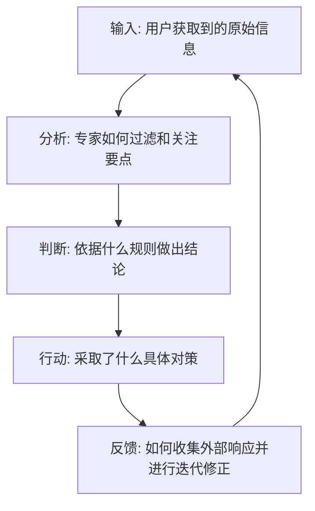

# Layer 2: MECHANISM - 底层物理机制

## 1. 标杆分析 (Benchmark Analysis)
* **谁是该领域最成功的人/最行之有效的模式**：
* **他们是如何做决策的**：详细拆解顶尖专家在处理该任务时的思维过程。

## 2. 决策与信息流向流程 (Information Flow Diagram)
请使用 Mermaid 或 ASCII 语法绘制从输入到行动的完整机制闭环。

## 3. 机制文字说明 (Mechanism Description)
* **输入阶段**：
* **分析阶段**：
* **判断阶段**：
* **行动阶段**：
* **反馈阶段**：
