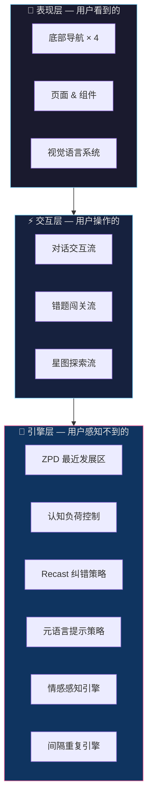
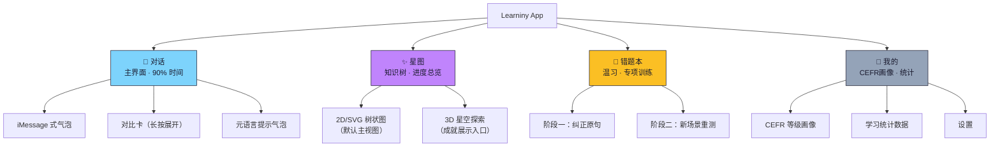
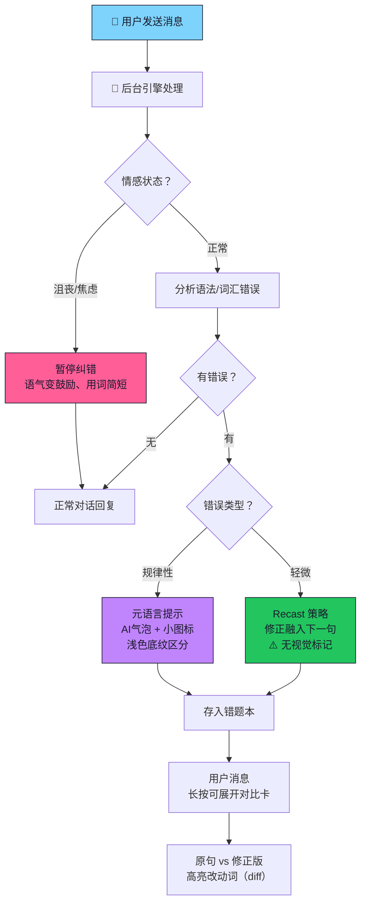
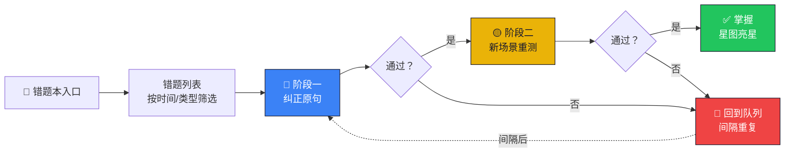
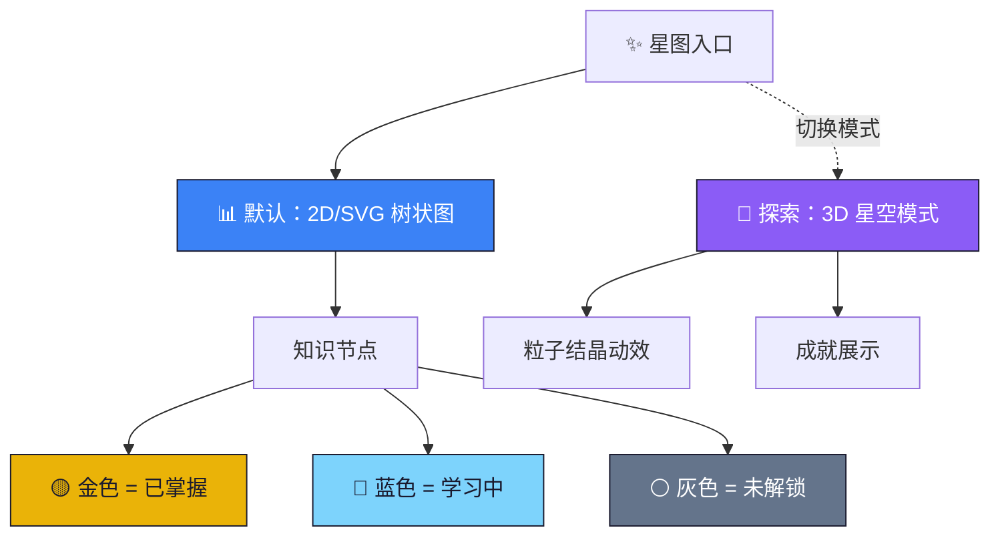
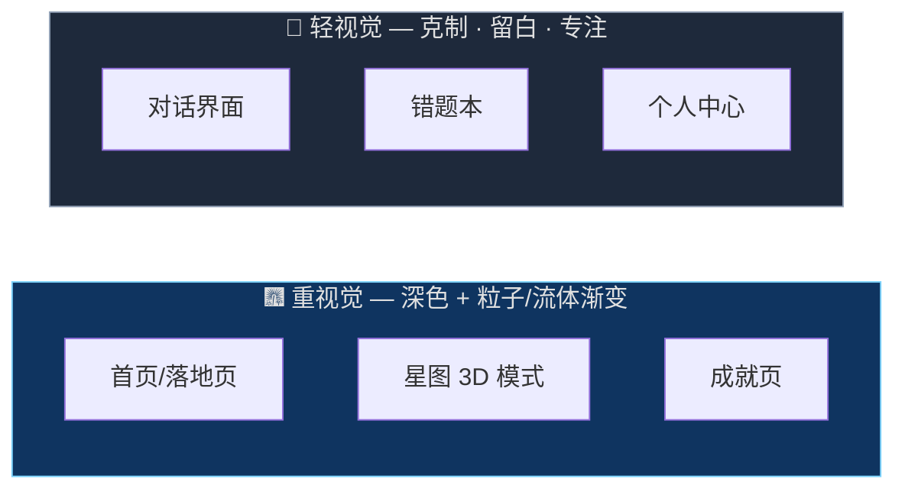
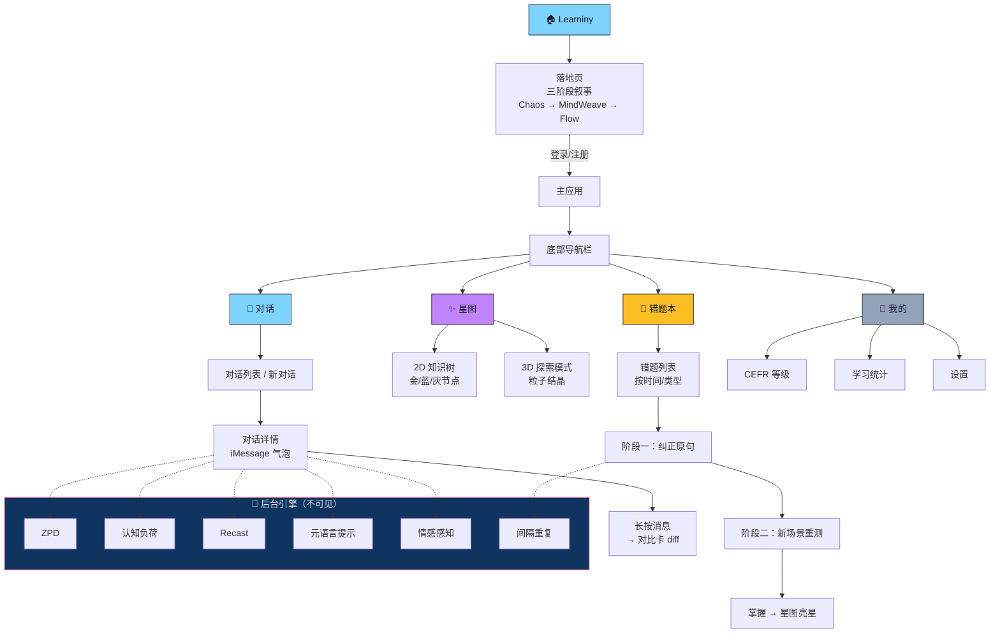

# Learniny — 信息架构图

> 核心设计原则：**把复杂系统藏在极简对话界面背后，复杂度只在用户主动要看时才展开。**

---

## 1. 整体分层架构

> [!IMPORTANT]
> 六大教学理论模块（ZPD、认知负荷、纠错策略等）全部作为**后台引擎**运行。用户永远感知不到"系统在计算"，只感知到"AI 好像懂我，难度刚刚好"。

---

## 2. 底部导航 & 页面结构

---

## 3. 对话界面 — 交互流程

对话界面是产品核心，占用户 **90% 使用时间**。设计原则：**像聊天，不像学习软件**。

> [!TIP]
> **Recast（重述纠错）**是设计上最难也最关键的部分 — 纠正必须听起来自然，用户不应察觉"这是纠错"。零视觉标记，纯靠语言融入。

---

## 4. 错题本 — 两阶段闯关流程

> [!NOTE]
> 视觉风格对标 **Notion / Linear** — 简洁专业的进度条和关卡样式，避免多邻国式的卡通萌宠风格。目标用户是职场人士和创业者。

---

## 5. 星图 — 双模式知识树

> [!IMPORTANT]
> 星图定位为**"周回顾"场景** — 每周打开一次，看看又亮了几颗星。制造仪式感和成就感，不是日常必经页面。

---

## 6. 后台引擎 → 前端体感映射

| 后台引擎 | 用户感知 | 前端表现 |
|---------|---------|---------|
| **ZPD 最近发展区** | "难度刚刚好" | AI 自动调整话题复杂度和词汇量 |
| **认知负荷控制** | "不觉得累" | 控制单次对话纠错频率，避免信息过载 |
| **Recast 纠错** | "AI 自然地说了正确说法" | 零标记，修正融入 AI 下一句话 |
| **元语言提示** | "AI 偶尔会点拨规律" | 气泡加小图标 + 浅色底纹 |
| **情感感知** | "AI 能看出我不开心" | 语气变鼓励、暂停纠错、更简短 |
| **间隔重复** | "忘了的东西又出现了" | 错题本定时推送 + 闯关复测 |

---

## 7. 视觉语言分区

> [!TIP]
> **对话界面必须克制** — 用户在对话时需要专注思考英语表达，不需要被粒子动效分心。重视觉效果只保留在非核心学习页面。

---

## 8. 完整信息架构总览

